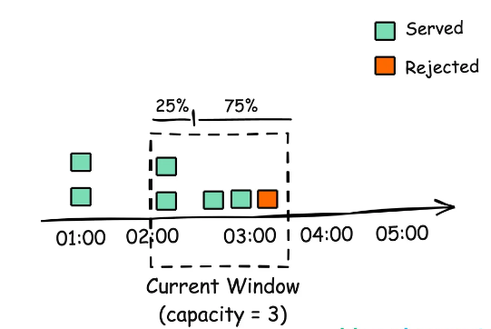
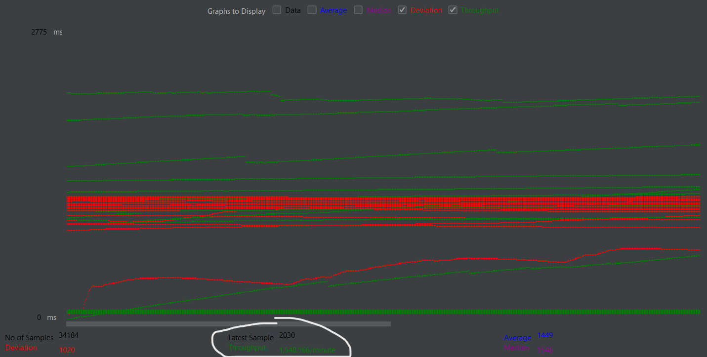
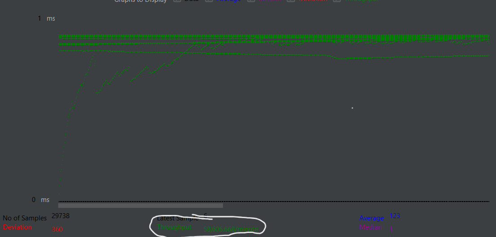
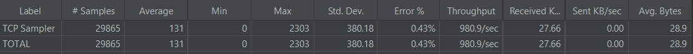

# Multithreaded Java Server with Rate Limiting

## Overview

This project is a multithreaded Java server application that implements a sliding window counter which creates a timewindow with a  rate-limiting mechanism to control request rates per client based on their IP address. It utilizes a thread pool to efficiently handle multiple concurrent requests, significantly improving performance compared to a traditional single-threaded  server.

## Features

- **Multithreading**: Utilizes a fixed-size thread pool to manage multiple client connections concurrently, enhancing the server's ability to handle high loads.
- **Sliding Window IP Rate Limiting**: Implements a sliding time window counter algorithm to limit the number of requests a client can make within a specified time window.And uses a concurrent hashmap to store IP address and its window size and rate limit
  
- **Concurrent Client Handling**: Allows multiple clients to connect simultaneously without blocking, improving response times and throughput.
- **Performance Metrics**: Demonstrated a **50%** efficiency improvement and up to a **60-fold** increase in throughput compared to a single-threaded server, validated using Apache JMeter.

## Technologies Used

- Java
- Java Networking
- Concurrent Programming
- Apache JMeter (for performance testing)

## Performance
### Single Threaded Performance 

### Multi-Threaded Performance

Utilized a thread pool for concurrent request handling, resulting in an efficiency improvement of approximately 50% and handling increase in throughput by up to 60 times compared to a single-threaded web server.